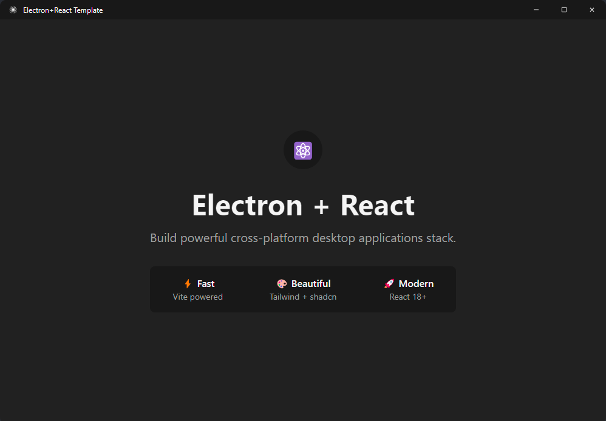

# Electron Starter with React + Vite + shadcn/ui



A modern, production-ready Electron starter template combining React, Vite, and shadcn/ui components for building high-performance desktop applications.

## ✨ Features

- **⚡ Vite** - Blazing fast HMR and instant builds
- **⚛️ React 18** - Modern UI library with hooks
- **🎨 Tailwind CSS** - Utility-first styling framework
- **🧩 shadcn/ui** - Pre-built accessible component library
- **🖥️ Electron** - Cross-platform desktop app framework
- **📦 electron-builder** - One-command app packaging & distribution
- **🔒 Security** - Preload scripts with IPC communication

## 🚀 Quick Start

### Install Dependencies

```bash
npm install
```

### Development

```bash
npm run dev
```

### Production Build

```bash
npm run build && npm run dist
```

## 📁 Project Structure

```
src/
├── main/              # Electron main process
│   ├── main.cjs
│   └── preload.cjs    # IPC bridge to renderer
└── renderer/          # React application
    ├── components/    # UI & layout components
    ├── styles/        # CSS & Tailwind
    ├── lib/           # Utilities
    └── App.jsx
```

## 🛠️ Available Scripts

| Command                | Purpose                   |
| ---------------------- | ------------------------- |
| `npm run dev`          | Run dev server + Electron |
| `npm run dev:vite`     | Vite dev server only      |
| `npm run dev:electron` | Electron only             |
| `npm run build`        | Build for production      |
| `npm run dist`         | Package app distribution  |

## 📝 IPC Communication

Secure communication between processes:

```javascript
window.electronAPI.minimize();
window.electronAPI.maximize();
window.electronAPI.close();
window.electronAPI.platform; // 'win32', 'darwin', 'linux'
```

## 📦 Tech Stack

- [Electron 26](https://www.electronjs.org/)
- [React 18](https://react.dev/)
- [Vite 5](https://vitejs.dev/)
- [Tailwind CSS 3](https://tailwindcss.com/)
- [shadcn/ui](https://ui.shadcn.com/)

## 📄 License

This project is licensed under the **CC0-1.0 License** - see the [LICENSE](./LICENSE) file for details. The CC0 license places this work in the public domain, allowing unrestricted use for any purpose.

## 👨‍💻 Author

[Tanvir Ahmed](https://github.com/nettanvirdev)
